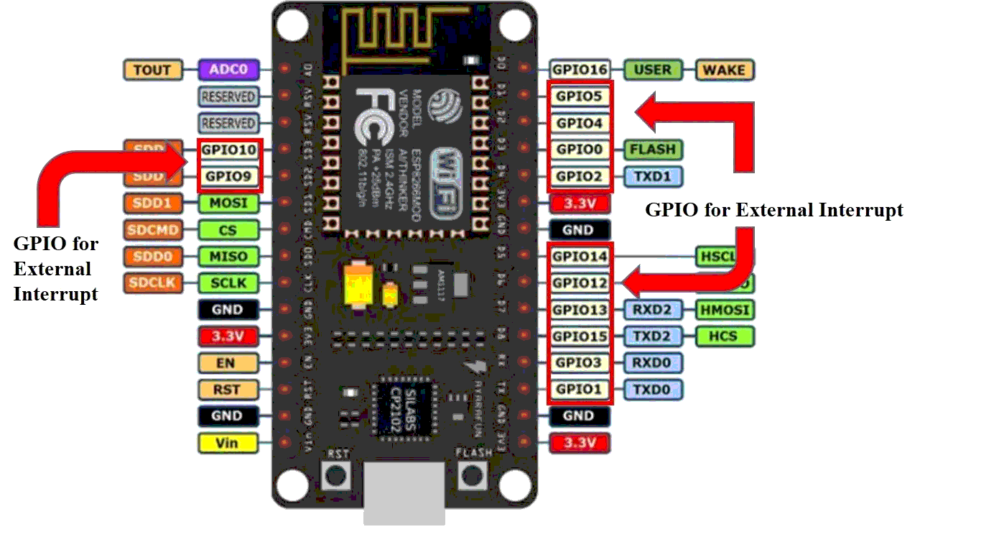
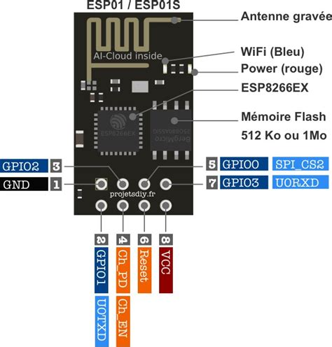

# ESP base domotique

[x] ESP8266 (NodeMCU)
[ ] ESP01

## NODE MCU pinout :


## ESP01 pinout :


## Architecture :
### credential.h :
paramètres du réseau WiFi

### core.h :
header du fichier `core.c`, il n'est pas nécessaire de le modifier.

### core.c :
fichier contenant le corp du programme contnenant ces fonction :

#### fonctions nécessaires :
 - coreSetup ( ) : initialisation des pin/Gpio avant l'initialisation du WiFi
 - coreLoop ( ) : fonction principale (ne doit pas être bloquante), appelée en continue
 - coreMqttCallback ( ) : fonction appelé sur réception d'un message sur un des topics suivit
 - coreMqttConnectCallback ( ) : fonction appelé lors de la connexion/reconnexion à un broker MQTT

#### fonctions exemples :
 - gpioIt ( ) : fonction d'interruption sur GPIO
 - onTimerISR ( ) : fonction d'interruption sur timer

## Utilisation :
### USB/Connexion :
Sur la COM USB, il est possible de paramétrer la carte lors du boot

```
You will use SSID, are you OK ? (Y/n)
```
si vous sélectionnez n(No), il sera demander de choisir le réseau a utiliser parmi ceux paramétré.

```
Curren ID: BoardId
Do you want to set/change board ID ? (y/N)
```

Le BoardId est à définir lors du premier boot de la carte puis est sauvegardé en mémoire EEPROM.

Ensuite c'est la Connexion au WiFi qui se lance :
```
[WiFi] %d, Connected
[WiFi] %d, Disconnected - Status %d, [Connected,Network not availible,Wrong password,Idle status,Disconnected,Unknown]
[WiFi] %d, AuthMode Change
[WiFi] %d, Got IP
X.X.X.X
[WiFi] %d, DHCP Timeout
```

Une fois le WiFi connecté vient le MQTT
```
[MQTT] Connected to MQTT.
[MQTT] Session present: %d
```

Si jamais au cours du fonctionnement le MQTT ou réseau plante, le système reprend la connexion où c'est nécessaire et recommence jusqu'à la connexion.

### MQTT :
Une fois La COM MQTT établie l'USB n'affichera plus rien et seul le MQTT sera utilisé. Il est possible de ne pas monitorer l'USB car le système est autonome.

#### Install :
Sous ubuntu :
```
$ apt install mosquitto-clients
```

#### Exemples :
publication sur un topic
```
> mosquitto_pub -t /path/topic -m message -h hostIP
```

abonnement a un topic
```
> mosquitto_sub -t /path/topic -h hostIP
```

S'abonner à tous les topics :
```
> mosquitto_sub -t /# -v -h hostIP
```

## IDE :
Utilisation de l'IE Ardiuno 1.8.18

## libs :
### async-mqtt-client :
Permet l'utilisation asynchrone de MQTT
 - [github](https://github.com/marvinroger/async-mqtt-client)
 - [lib zip](https://codeload.github.com/marvinroger/async-mqtt-client/zip/refs/heads/develop)

### ESPAsyncTCP :
Lib TCP async dependance de async MQTT
 - [github](https://github.com/me-no-dev/ESPAsyncTCP)
 - [lib zip](https://codeload.github.com/me-no-dev/ESPAsyncTCP/zip/refs/heads/master)

## ressources :
 - NodeMCU interruptions : https://microcontrollerslab.com/esp8266-interrupts-timers-arduino-ide-nodemcu/
 - NodeMCU timer1 : https://www.esp8266.com/viewtopic.php?t=17549