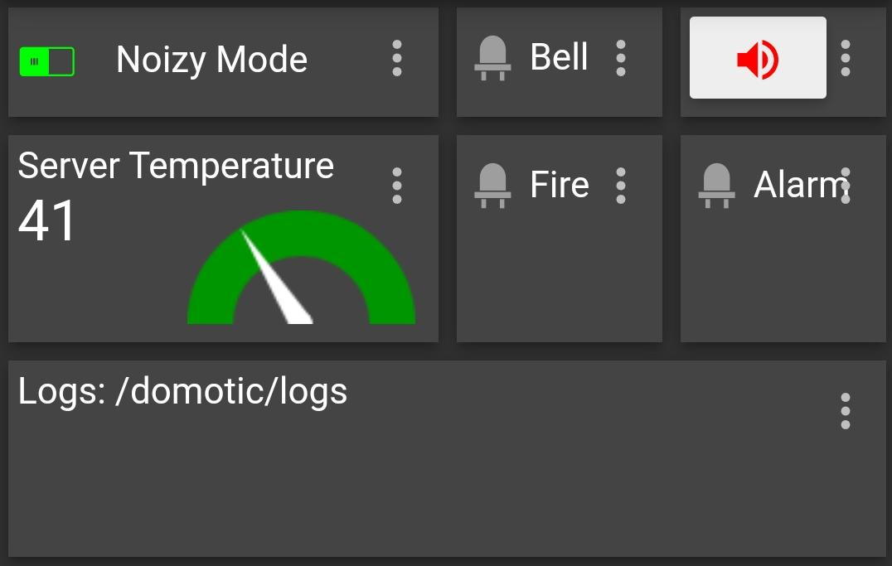

# Bell :

## Topics :
| topic 						| content 			| comment				|
| ---							| ---				| ---					|
| 								| 					| in					|
| ---							| ---				| ---					|
| /domotic/bell/duration" 		| float	> 0			| sound duration		|
| /domotic/bell/help" 			| null				| availables cmds		|
| /domotic/bell/status" 		| quiet/noizy/force	| work mode 			|
| /domotic/break" 				| on/off			| breaking in alarm		|
| /domotic/fire" 				| on/off			| fire alarm 			|
| ---							| ---				| ---					|
| 								| 					| out					|
| ---							| ---				| ---					|
| /domotic/bell" 				| on/off			|						|

## Pinout :
### NodeMCU :
- D4 : LED
- D3 : sortie ToR sur un truc qui fait du bruit
- D2 : bouton d'entrée

## Usage esemple :
